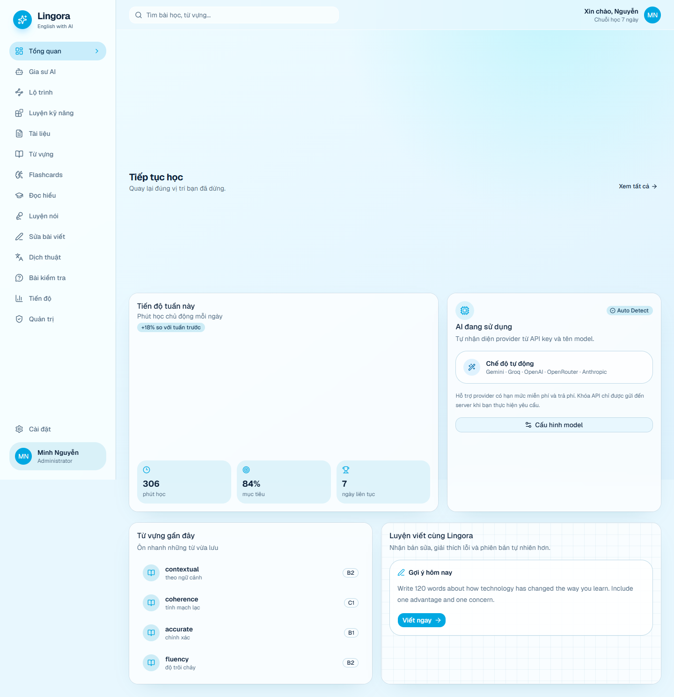
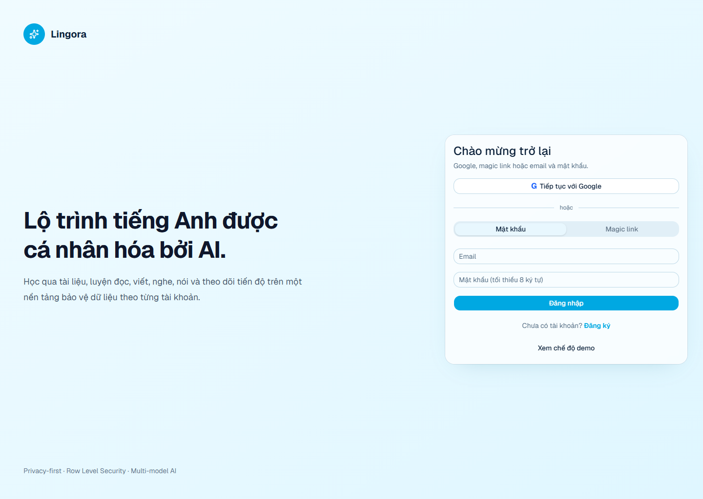
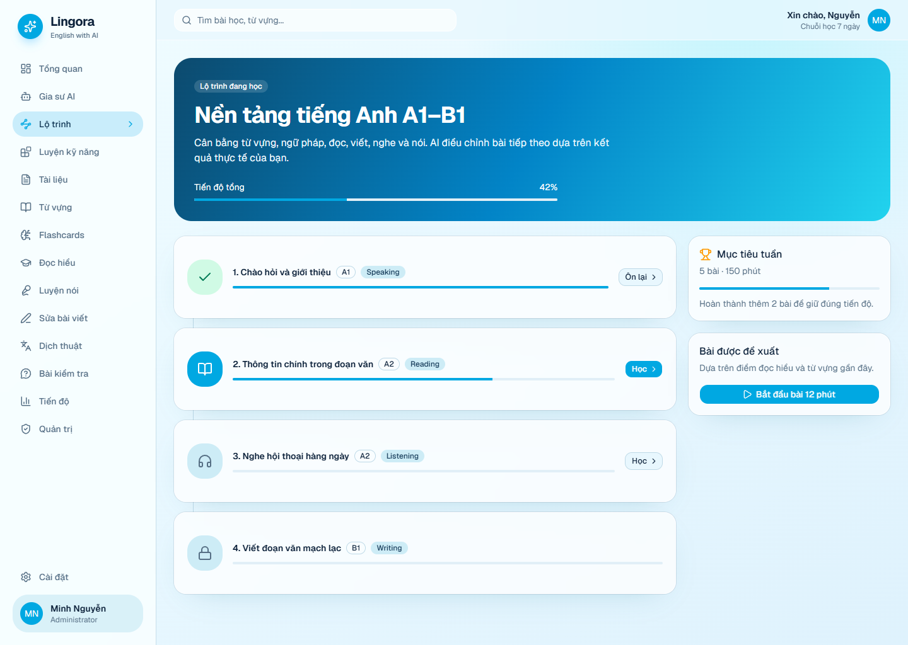
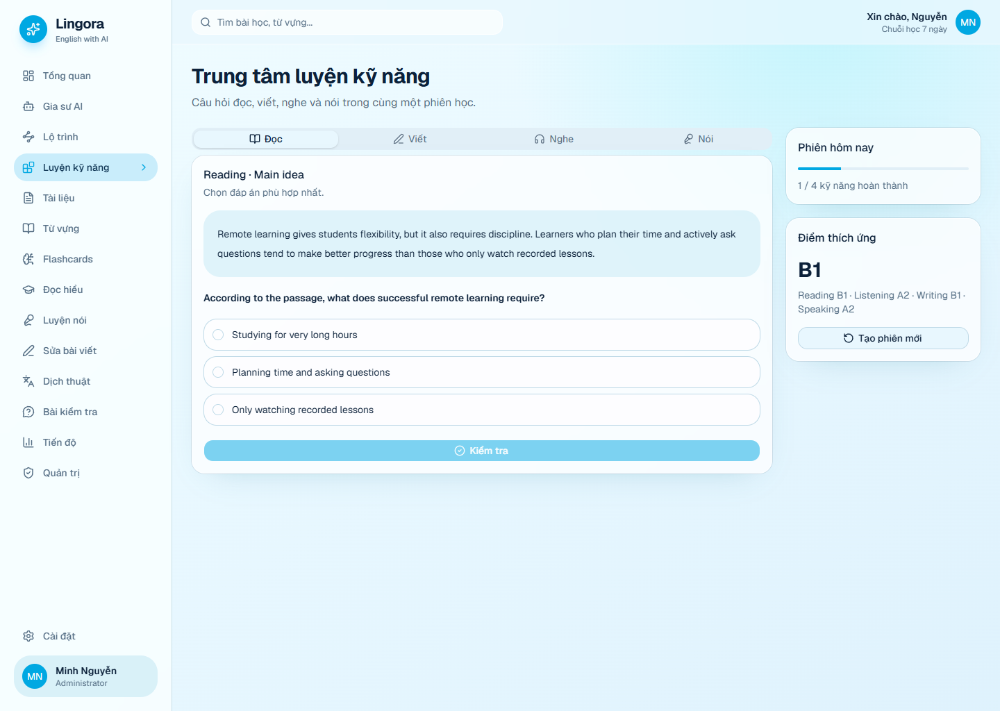
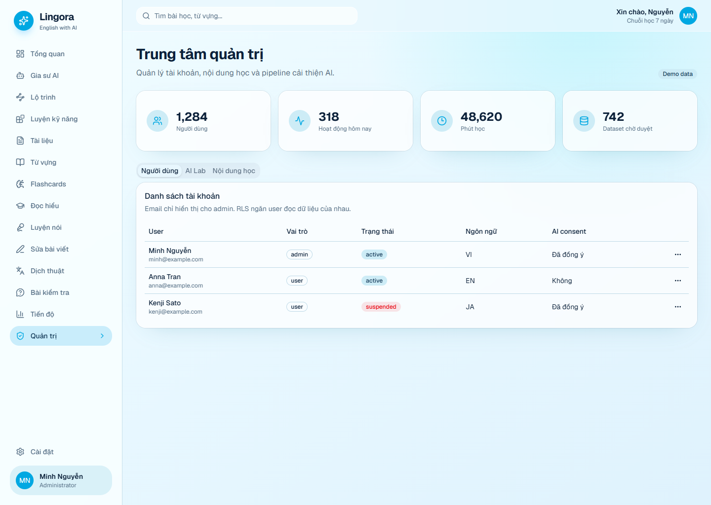
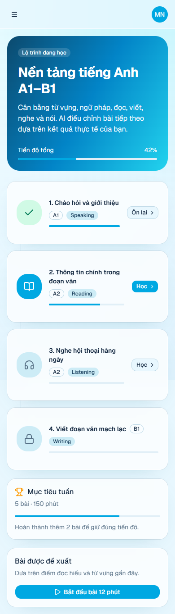
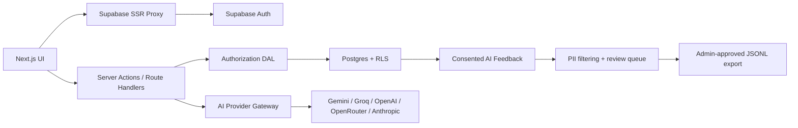

<div align="center">

# Lingora AI

### Privacy-first, multi-model English learning for global learners

[](https://github.com/Meranh05/LingoraAI/actions/workflows/ci.yml)
[](https://nextjs.org/)
[](https://supabase.com/)
[](https://www.typescriptlang.org/)
[](LICENSE)
[](https://github.com/Meranh05/LingoraAI/stargazers)

**[English](#english) · [Tiếng Việt](#tiếng-việt) · [Setup](#quick-start) · [Architecture](#architecture)**

 

</div>

## English

Lingora is an open-source AI English-learning platform built for document-based
learning, adaptive practice and privacy-conscious personalization.

It combines:

- Google OAuth, magic-link and email/password authentication.
- User/admin role-based access and server-side authorization.
- Row Level Security so every learner only accesses their own private data.
- Reading, writing, listening and speaking practice.
- Document extraction, bilingual summaries, questions and vocabulary.
- Learning roadmaps, skill mastery and progress analytics.
- OpenAI, Gemini, Groq, OpenRouter, Anthropic and custom compatible APIs.
- Stripe subscriptions with Basic, Plus and Pro plans in VND or USD.
- A consent-based AI feedback pipeline for building anonymized training data.
- Vietnamese, English, Japanese and Thai navigation.

> Lingora does **not** silently train on private conversations. Training
> candidates are created only from explicit feedback when consent is enabled,
> anonymized, and reviewed by an administrator before export.

## Tiếng Việt

Lingora là nền tảng học tiếng Anh mã nguồn mở có AI, tập trung vào học theo tài
liệu, luyện kỹ năng thích ứng và bảo vệ dữ liệu người dùng.

### Điểm nổi bật

- Đăng nhập Google, magic link, email và mật khẩu.
- Phân quyền `user` / `admin`, khóa hoặc mở tài khoản.
- RLS bảo đảm user chỉ đọc và sửa dữ liệu thuộc tài khoản của chính mình.
- Lộ trình A1–B1, mục tiêu ngày, tiến độ từng kỹ năng.
- Câu hỏi đọc, viết, nghe, nói; phản hồi và chấm điểm trực tiếp.
- Upload PDF, DOCX, TXT; tóm tắt song ngữ, tạo quiz và bộ từ vựng.
- Gia sư AI có memory cá nhân, feedback tốt/xấu và model gateway đa provider.
- AI Lab xuất JSONL từ dữ liệu đã consent, khử định danh và được admin duyệt.
- UI responsive cho desktop/mobile và điều hướng đa ngôn ngữ.

## Product Tour

| Authentication | Learning roadmap |
| --- | --- |
|  |  |

| Adaptive practice | Administration |
| --- | --- |
|  |  |

<details>
<summary>Mobile roadmap</summary>



</details>

## Feature Matrix

| Area | Included |
| --- | --- |
| Authentication | Google OAuth, magic link, password, PKCE callback, SSR cookies |
| Authorization | Proxy session refresh, server DAL, admin API checks, RLS |
| Learning | Roadmap, reading, writing, listening, speaking, vocabulary, quiz |
| Documents | PDF/DOCX/TXT extraction, summary, questions, vocabulary |
| AI | Multi-provider gateway, auto-detect, user memory, explicit feedback |
| Admin | User role/status management, metrics, AI Lab, JSONL export |
| Billing | Stripe Checkout, Customer Portal, webhook sync, quotas, revenue dashboard |
| Privacy | Per-user rows, private storage, consent snapshot, PII filtering |
| Internationalization | Vietnamese, English, Japanese and Thai navigation |

## Quick Start

Requirements:

- Node.js 20.16+ or 22+
- pnpm 10+
- A Supabase project for production authentication/data

```bash
git clone https://github.com/Meranh05/LingoraAI.git
cd LingoraAI
pnpm install
Copy-Item .env.example .env.local
pnpm dev
```

Open [http://localhost:3000](http://localhost:3000).

Lingora does not fabricate demo user data. Without Supabase variables, protected
routes redirect to `/setup` and remain unavailable until the database is
configured.

## Supabase Setup

1. Create a Supabase project.
2. Copy the project URL, publishable key and secret key to `.env.local`.
3. Run migrations in order:

```text
supabase/migrations/202606090001_initial_lingora.sql
supabase/migrations/202606090002_auth_rbac_learning_ai.sql
supabase/migrations/202606090003_real_learning_workflows.sql
supabase/migrations/202606090004_security_hardening.sql
supabase/migrations/202606100001_competition_leaderboard.sql
supabase/migrations/202606100002_billing_subscriptions.sql
```

4. Enable Email and Google in **Authentication → Providers**.
5. Add callback URLs:

```text
http://localhost:3000/auth/callback
https://your-domain.com/auth/callback
```

6. Register the first user, then promote that user once in SQL Editor:

```sql
update public.profiles
set role = 'admin'
where id = (
  select id from auth.users where email = 'owner@example.com'
);
```

Never expose `SUPABASE_SECRET_KEY` to browser code.

## Environment

```dotenv
NEXT_PUBLIC_APP_URL=http://localhost:3000

NEXT_PUBLIC_SUPABASE_URL=
NEXT_PUBLIC_SUPABASE_PUBLISHABLE_KEY=
SUPABASE_SECRET_KEY=

OPENAI_API_KEY=
GEMINI_API_KEY=
GROQ_API_KEY=
OPENROUTER_API_KEY=
ANTHROPIC_API_KEY=

STRIPE_SECRET_KEY=
STRIPE_WEBHOOK_SECRET=
```

## Stripe Billing

Lingora uses Stripe Checkout for recurring subscriptions and Stripe Customer
Portal for payment-method updates, invoices and cancellation.

1. Add the Stripe test secret key to `STRIPE_SECRET_KEY`.
2. Create a webhook endpoint pointing to
   `https://your-domain.com/api/billing/webhook`.
3. Subscribe it to `checkout.session.completed`,
   `customer.subscription.created`, `customer.subscription.updated`,
   `customer.subscription.deleted`, `invoice.paid` and
   `invoice.payment_failed`.
4. Copy the webhook signing secret to `STRIPE_WEBHOOK_SECRET`.
5. Configure Stripe Customer Portal in the Stripe Dashboard.

For local webhook testing:

```bash
stripe listen --forward-to localhost:3000/api/billing/webhook
```

The default monthly catalog is Basic (`99,000 VND` / `$4.99`), Plus
(`199,000 VND` / `$8.99`) and Pro (`399,000 VND` / `$16.99`). Edit
`public.billing_plans` to change prices or limits.

Every plan supports card payment and a one-time three-day trial without a card.
Admin accounts also see a developer-only no-card Checkout button while the
server uses an `sk_test_` Stripe Sandbox key.

Users may alternatively enter an AI key for the current browser tab. It is
stored in `sessionStorage`, sent only to a server Route Handler, and never saved
to Supabase.

## Architecture



Security is enforced at multiple layers:

1. Supabase validates SSR tokens with `getClaims()`.
2. Pages and APIs verify viewer/admin permissions server-side.
3. Postgres RLS enforces row ownership.
4. Secret-key admin operations only run on the server.

See [docs/ARCHITECTURE.md](docs/ARCHITECTURE.md) for additional details.

## Development

```bash
pnpm lint
pnpm typecheck
pnpm test
pnpm build

# Run everything
pnpm check
```

## Roadmap

- Real streaming responses and resumable chat sessions.
- Speech-to-text provider adapters and pronunciation scoring.
- Background document chunking and embeddings jobs.
- Admin content authoring and training-candidate review workflow.
- More complete translated content and locale-aware course packs.
- Self-hosted model evaluation and fine-tuning recipes.

## Contributing

Issues, translations, course content and provider adapters are welcome. Read
[CONTRIBUTING.md](CONTRIBUTING.md) before opening a pull request.

If Lingora is useful, consider starring the repository, sharing a screenshot,
or opening a focused issue. Specific feedback is more useful than generic
promotion.

## Security

Please do not disclose vulnerabilities in public issues. Follow
[SECURITY.md](SECURITY.md).

## License

Distributed under the repository [LICENSE](LICENSE).
