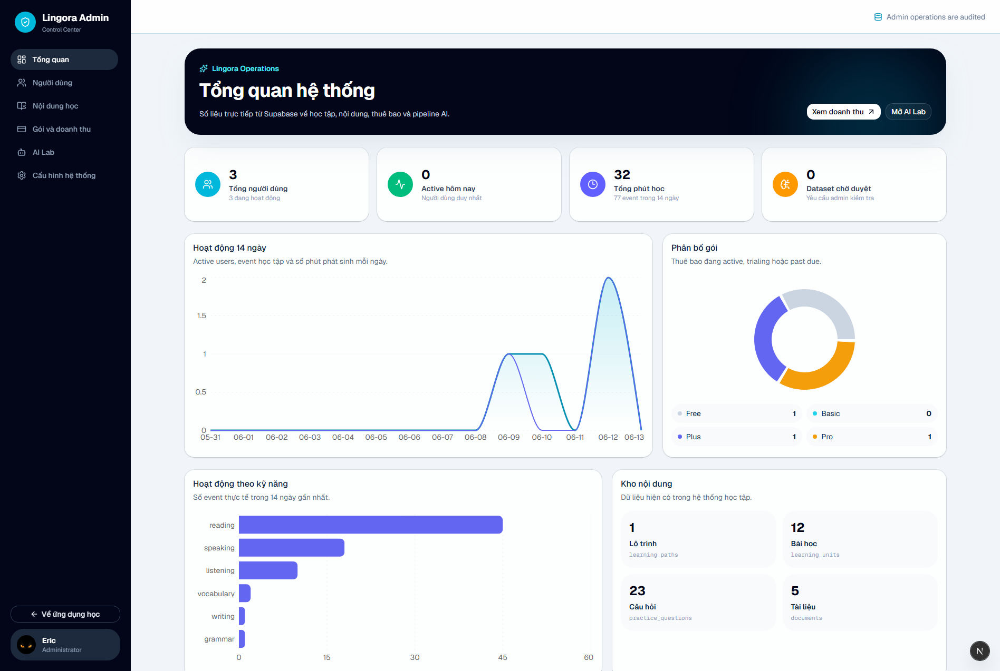
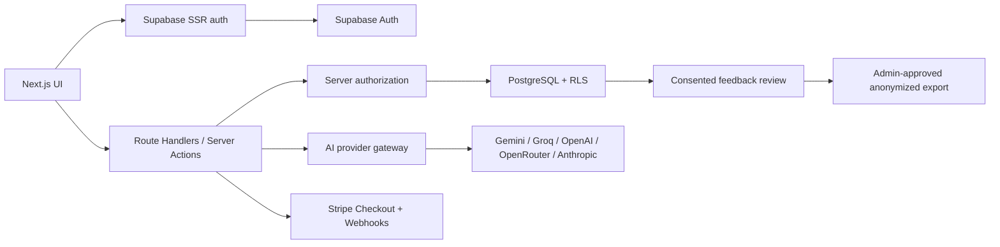

<div align="center">


# Lingora AI

### Privacy-first AI language learning with strict progression, real user data and multi-model support

[](https://github.com/Meranh05/LingoraAI/actions/workflows/ci.yml)
[](https://nextjs.org/)
[](https://react.dev/)
[](https://supabase.com/)
[](https://www.typescriptlang.org/)
[](LICENSE)
[](https://github.com/Meranh05/LingoraAI/stargazers)

[English](#english) · [Tiếng Việt](#tiếng-việt) · [Quick Start](#quick-start) · [Configuration](#configuration) · [Architecture](#architecture)


</div>

## English

Lingora is an open-source AI-assisted English learning platform built with
Next.js, Supabase and Stripe. It combines structured learning stages,
skill-based practice, document learning, gamification and configurable AI
providers in one account-isolated application.

### What is implemented

- Google OAuth, magic link and email/password authentication.
- Server-side `user` / `admin` authorization and Supabase Row Level Security.
- Strict stage progression: completing stage A is required before stage B.
- Stage sessions that only accept questions assigned to the active unit.
- Server-calculated completion scores, one-time rewards and anti-spam controls.
- Completion dialog with answers, correct answers, score and next-stage action.
- Difficult-question review queue persisted per learner.
- AI Tutor with saved conversations, document context and answer feedback.
- Reading, listening, speaking, writing, translation, quiz and vocabulary tools.
- Azure, Google and LibreTranslate machine translation with automatic language
  detection and server-side keys.
- Flashcards with spaced review and learner-owned vocabulary.
- PDF, DOCX and TXT extraction with AI learning tools.
- XP, tokens, daily/weekly challenges, levels and competition leaderboards.
- Stripe plans, customer portal, subscription webhooks and token purchases.
- Avatar uploads through Supabase Storage with ownership policies.
- User preferences for sound, motion, mascot, compact mode and reminders.
- Vietnamese, English, Japanese and Thai interface support.
- Modern admin console for users, content, billing, AI and system diagnostics.

> Lingora never silently trains on private conversations. Training candidates
> require explicit feedback, learner consent, PII filtering and administrator
> review before export.

## Tiếng Việt

Lingora là nền tảng học tiếng Anh mã nguồn mở có AI, sử dụng dữ liệu thật theo
từng tài khoản và bảo vệ dữ liệu bằng Supabase RLS.

### Tính năng chính

- Đăng ký/đăng nhập bằng Google, magic link, email và mật khẩu.
- Phân quyền `user` / `admin`; user chỉ truy cập dữ liệu của chính mình.
- Lộ trình khóa tuần tự: hoàn thành chặng trước mới mở chặng tiếp theo.
- Mỗi phiên chặng chỉ ghi nhận câu hỏi thuộc đúng chặng đang học.
- Popup tổng kết điểm, câu trả lời, đáp án đúng, XP/token và nút qua chặng mới.
- Thưởng hoàn thành chỉ nhận một lần; có idempotency và giới hạn chống spam.
- Câu sai hoặc được đánh dấu khó được lưu vào danh sách ôn lại.
- Gia sư AI đa provider, hội thoại lưu theo tài khoản và hỏi đáp theo tài liệu.
- Luyện đọc, nghe, nói, viết, dịch thuật, quiz, từ vựng và flashcards.
- Hệ thống level, nhiệm vụ, thi đua, bảng xếp hạng, XP và Lingora Token.
- Upload ảnh đại diện thật bằng Supabase Storage.
- Cài đặt âm thanh, hoạt ảnh, linh vật, giao diện thu gọn và nhắc học.
- Admin Console quản lý người dùng, nội dung, AI, gói dịch vụ và hệ thống.

## Product Tour

| Authentication | Learning roadmap |
| --- | --- |
|  |  |

| Adaptive practice | Administration |
| --- | --- |
|  |  |

### Live administration analytics

The administration dashboard reads directly from Supabase and visualizes
14-day learning activity, plan distribution, skill engagement and the current
content inventory.



<details>
<summary>Mobile roadmap preview</summary>


</details>

## Modules

| Module | Capabilities |
| --- | --- |
| AI Tutor | Multi-model chat, document context, persisted sessions, feedback |
| Roadmap | Sequential units, mastery gates, completion summaries, boss stages |
| Skill Practice | Reading, listening, speaking and writing progress |
| Documents | PDF/DOCX/TXT extraction, summaries, questions and vocabulary |
| Vocabulary | Personal word library and review scheduling |
| Flashcards | Learner-owned cards and spaced repetition |
| Speaking | Microphone permission diagnostics and Web Speech transcription |
| Quiz | Multiple choice, fill blank, dictation, matching and sentence order |
| Progress | Skill mastery, attempts, study time, streaks and levels |
| Competition | Opt-in leaderboard, weekly challenges and anti-spam scoring |
| Economy | XP, Lingora Tokens, temporary unlocks and Stripe purchases |
| Settings | Profile, avatar, locale, preferences, AI keys and diagnostics |
| Admin | Users, content studio, billing metrics, AI Lab and system status |

## Tech Stack

- Next.js 16 App Router and React 19
- TypeScript in strict mode
- Tailwind CSS 4 and shadcn/Base UI components
- Supabase Auth, PostgreSQL, RLS and Storage
- Stripe Checkout, Billing Portal and webhooks
- Gemini, Groq, OpenAI, OpenRouter, Anthropic and custom compatible endpoints
- Vitest and GitHub Actions

## Quick Start

Requirements:

- Node.js 22 recommended
- pnpm 10+
- A Supabase project

```bash
git clone https://github.com/Meranh05/LingoraAI.git
cd LingoraAI
pnpm install
```

Windows PowerShell:

```powershell
Copy-Item .env.example .env.local
pnpm dev
```

macOS/Linux:

```bash
cp .env.example .env.local
pnpm dev
```

Open [http://localhost:3000](http://localhost:3000).

Protected routes redirect to `/setup` until Supabase is configured. Lingora
does not generate fake learner records when the backend is missing.

## Configuration

```dotenv
NEXT_PUBLIC_APP_URL=http://localhost:3000

NEXT_PUBLIC_SUPABASE_URL=
NEXT_PUBLIC_SUPABASE_PUBLISHABLE_KEY=
SUPABASE_SECRET_KEY=

GEMINI_API_KEY=
GROQ_API_KEY=
OPENAI_API_KEY=
OPENROUTER_API_KEY=
ANTHROPIC_API_KEY=
GOOGLE_CLOUD_TRANSLATION_API_KEY=
AZURE_TRANSLATOR_KEY=
AZURE_TRANSLATOR_REGION=
AZURE_TRANSLATOR_ENDPOINT=https://api.cognitive.microsofttranslator.com
LIBRETRANSLATE_URL=
LIBRETRANSLATE_API_KEY=

STRIPE_SECRET_KEY=
STRIPE_WEBHOOK_SECRET=
```

`NEXT_PUBLIC_SUPABASE_PUBLISHABLE_KEY` is intended for browser use with RLS.
`SUPABASE_SECRET_KEY`, AI provider keys and Stripe secrets must remain
server-only.

Users can alternatively enter an AI API key in Settings. Browser-entered keys
are kept in `sessionStorage`, sent to a server Route Handler only when making a
request, and are not persisted to Supabase.

## Supabase Setup

1. Create a Supabase project.
2. Add its URL, publishable key and secret key to `.env.local`.
3. Apply every SQL file in `supabase/migrations` in filename order.
4. Enable the required providers in **Authentication → Sign In / Providers**.
5. Add the following redirect URLs:

```text
http://localhost:3000/auth/callback
https://your-domain.com/auth/callback
```

For Google OAuth, register this callback URL in Google Cloud:

```text
https://YOUR_PROJECT_REF.supabase.co/auth/v1/callback
```

The migrations create:

- User-owned learning tables and RLS policies.
- Roadmaps, units, questions, sessions and strict completion rewards.
- Competition, challenges, wallets, token unlocks and anti-spam functions.
- Billing plans, subscriptions, transactions and webhook records.
- AI feedback/training review tables.
- Public avatar bucket with user-scoped upload/update/delete policies.

Promote the first administrator once in Supabase SQL Editor:

```sql
update public.profiles
set role = 'admin'
where id = (
  select id from auth.users where email = 'owner@example.com'
);
```

## AI Providers

Lingora can automatically detect a provider from the selected provider, API key
prefix, model name or custom Base URL.

| Provider | Environment variable |
| --- | --- |
| Gemini | `GEMINI_API_KEY` |
| Groq | `GROQ_API_KEY` |
| OpenAI | `OPENAI_API_KEY` |
| OpenRouter | `OPENROUTER_API_KEY` |
| Anthropic | `ANTHROPIC_API_KEY` |
| Compatible API | Custom Base URL and model in Settings |

Retryable provider failures such as HTTP `429`, `500`, `502`, `503` and `504`
use bounded retries and return actionable messages to the interface.

### Machine Translation

The Translation workspace uses a server-side provider chain:

```text
Azure AI Translator → Google Cloud Translation → LibreTranslate → Lingora AI fallback
```

The browser only calls Lingora's authenticated `/api/translation` route. API
keys stay on the server, and translation text is not stored in learning-event
metadata.

Recommended free/low-cost setup:

1. Create an Azure account and enable **Azure AI Translator** on the F0 tier.
2. Copy the resource key and region into `.env.local`:

```dotenv
AZURE_TRANSLATOR_KEY=your_azure_translator_key
AZURE_TRANSLATOR_REGION=your_resource_region
AZURE_TRANSLATOR_ENDPOINT=https://api.cognitive.microsofttranslator.com
```

Google Cloud Translation can be used as a second provider:

1. Create or select a project in Google Cloud Console.
2. Enable **Cloud Translation API** and attach a billing account.
3. Create an API key under **APIs & Services → Credentials**.
4. Restrict the key to **Cloud Translation API**.
5. Add the key to `.env.local`:

```dotenv
GOOGLE_CLOUD_TRANSLATION_API_KEY=your_server_side_key
```

LibreTranslate can be self-hosted or pointed at a trusted instance:

```dotenv
LIBRETRANSLATE_URL=http://localhost:5000
LIBRETRANSLATE_API_KEY=
```

After changing translation environment variables, restart the Next.js server.
The UI supports automatic source-language detection, explicit source/target
selection, language swapping and copy-to-clipboard.

## Speech Recognition

Speaking practice uses the browser Web Speech API.

- Use a current Chrome or Edge browser.
- The page must run on HTTPS or `localhost`.
- Microphone permission must be allowed for the site.
- Browser speech transcription may require Internet even after microphone
  permission succeeds.
- VPNs, firewalls or restricted networks can block the browser speech service.

Settings includes diagnostics for network state, secure context, microphone,
speech support, cookies and server AI providers.

## Stripe Billing

Lingora uses Stripe Checkout for subscriptions and token purchases, Stripe
Customer Portal for account management, and signed webhooks for synchronization.

Create a webhook endpoint:

```text
https://your-domain.com/api/billing/webhook
```

Subscribe it to:

```text
checkout.session.completed
customer.subscription.created
customer.subscription.updated
customer.subscription.deleted
invoice.paid
invoice.payment_failed
```

Local webhook forwarding:

```bash
stripe listen --forward-to localhost:3000/api/billing/webhook
```

The seeded catalog includes Basic, Plus and Pro plans. Prices and limits are
stored in `public.billing_plans` and can be managed from the database/admin
workflow. Test-mode admin accounts can use the developer checkout flow; normal
users can use card checkout or the one-time three-day trial flow.

## Architecture



Security is enforced through:

1. SSR token validation with Supabase `getClaims()`.
2. Server-side authorization for pages and mutations.
3. PostgreSQL RLS for user-owned rows.
4. User-scoped Storage policies for avatar mutations.
5. Server-only service, AI and Stripe secrets.
6. Idempotency and database claims for rewards and payments.

See [docs/ARCHITECTURE.md](docs/ARCHITECTURE.md).

## Development

```bash
pnpm lint
pnpm typecheck
pnpm test
pnpm build

# Run the complete quality gate
pnpm check
```

The GitHub Actions workflow runs the same quality gate for pull requests and
pushes to `main`.

## Current Limitations

- Web Speech availability depends on browser and network services.
- AI responses are request/response based; token streaming is not implemented.
- Document extraction runs in the request lifecycle rather than a background
  worker queue.
- Complete translated learning packs still depend on published content.

## Contributing

Bug fixes, translations, CEFR content, accessibility improvements and provider
adapters are welcome. Read [CONTRIBUTING.md](CONTRIBUTING.md) before opening a
pull request.

If Lingora is useful, star the repository, share a screenshot or open a focused
issue with reproducible details.

## Security

Do not disclose authentication bypasses, RLS failures, secret exposure or
cross-user access in public issues. Follow [SECURITY.md](SECURITY.md).

## License

Lingora is distributed under the [GNU General Public License v3.0](LICENSE).
